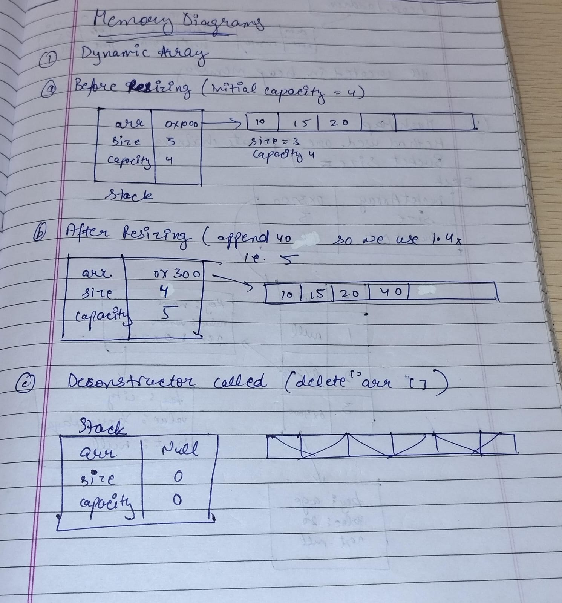
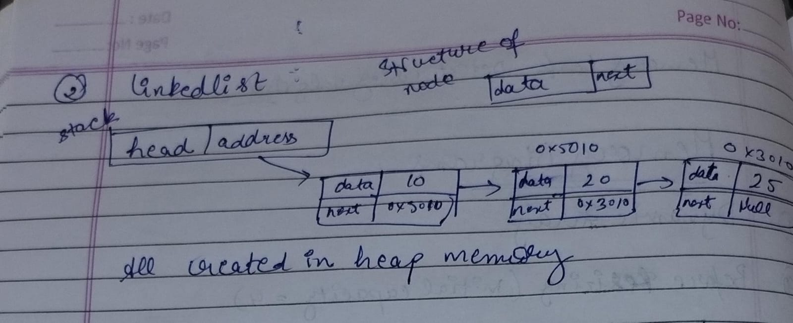
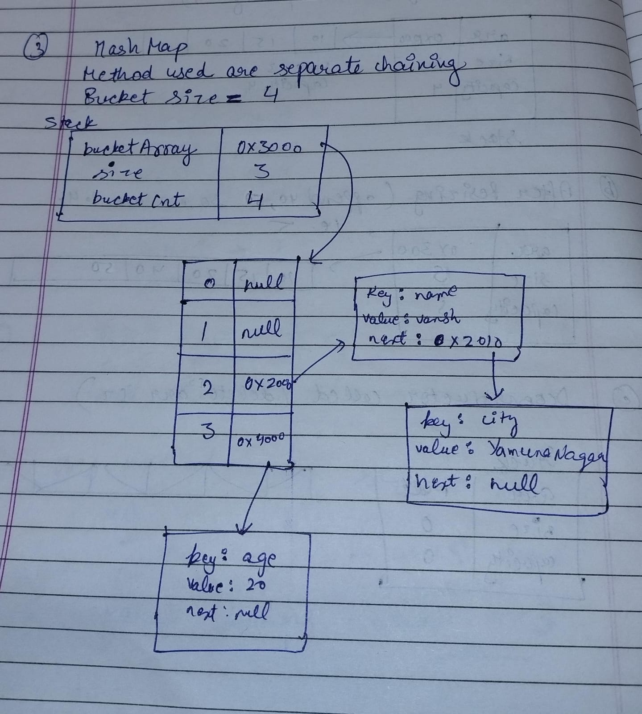

# SuperCoders Collections Library

# Professional Design Proposal

## 1. Executive Summary

This document presents the design and implementation proposal for a custom C++ Collections Library developed without relying on STL container classes. The library provides three fundamental data structures: DynamicArray, LinkedList, and HashMap. The objective is to demonstrate a strong understanding of dynamic memory management, templates, object-oriented programming, copy semantics, and algorithmic efficiency.

## 2. Project Objectives

- Implement DynamicArray, LinkedList, and HashMap from scratch.
- Apply templates to support generic data types.
- Implement deep copy semantics using the Rule of Three.
- Analyze performance using time complexity.
- Design reusable and maintainable data structure components.

## 3. System Architecture

DynamicArray stores elements in contiguous memory and grows dynamically using a growth factor of 1.4x.

LinkedList stores elements as heap-allocated nodes connected through pointers, enabling efficient insertion and deletion.

HashMap stores key-value pairs using hashing and separate chaining for collision resolution. Rehashing is performed when the load factor exceeds 0.75.

## 4. Folder Structure

data_structure_collections/
├── include/
│   ├── DynamicArray.h
│   ├── LinkedList.h
│   ├── HashMap.h
├── src/
│   ├── DynamicArray.cpp
│   ├── LinkedList.cpp
│   ├── HashMap.cpp
├── docs/
│   └── Design_Proposal.md
├── main.cpp
├── README.md
└── .gitignore

## 5. Public API's

### Dynamic Array

DynamicArray<T>: append, insert, remove, get, set, clear, getSize, getCapacity

| Return Type   | Method                                  |
|---------------|-----------------------------------------|
| —             | DynamicArray()                          |
| —             | DynamicArray(const DynamicArray& other) |
| DynamicArray& | operator=(const DynamicArray& other)    |
| —             | ~DynamicArray()                         |
| void          | append(const T& value)                  |
| void          | insert(int index, const T& value)       |
| void          | remove(int index)                       |
| T&            | get(int index)                          |
| void          | set(int index, const T& value)          |
| int           | getSize() const                         |
| int           | getCapacity() const                     |
| bool          | isEmpty() const                         |
| void          | clear()                                 |

### Linked List

LinkedList<T>: pushFront, pushBack, insert, removeAt, contains, get, clear.

| Return Type | Method                              |
|-------------|-------------------------------------|
| —           | LinkedList()                        |
| —           | LinkedList(const LinkedList& other) |
| LinkedList& | operator=(const LinkedList& other)  |
| —           | ~LinkedList()                       |
| void        | pushFront(const T& value)           |
| void        | pushBack(const T& value)            |
| void        | insert(int index, const T& value)   |
| bool        | removeFront()                       |
| bool        | removeBack()                        |
| void        | removeAt(int index)                 |
| bool        | contains(const T& value) const      |
| T&          | get(int index)                      |
| int         | getSize() const                     |
| bool        | isEmpty() const                     |
| void        | clear()                             |

### HashMap

HashMap<K,V>: put, get, remove, containsKey, loadFactor, rehash, clear.

| Return Type | Method                            |
|-------------|-----------------------------------|
| —           | HashMap()                         |
| —           | HashMap(const HashMap& other)     |
| HashMap&    | operator=(const HashMap& other)   |
| —           | ~HashMap()                        |
| void        | put(const K& key,const V& value)  |
| bool        | get(const K& key,V& value) const  |
| bool        | remove(const K& key)              |
| bool        | containsKey(const K& key) const   |
| int         | size() const                      |
| void        | clear()                           |
| double      | loadFactor() const                |
| void        | rehash()                          |

## 6. Design Decisions and Justification

DynamicArray was selected for O(1) random access and cache-friendly storage.

An initial capacity of 4 was chosen to keep memory usage low for small datasets while providing enough space for initial insertions without immediate resizing.

A growth factor of 1.4 was selected to balance memory efficiency and reallocation cost, reducing wasted memory while maintaining reasonable insertion performance.

LinkedList was selected for efficient insertion and deletion without shifting elements.

HashMap was selected to provide average O(1) insertion, lookup, and deletion. Separate chaining was chosen because it is simple, reliable, and easier to maintain than open addressing.

- Initial Capacity (4): Chosen to minimize initial memory consumption while supporting a small number of elements efficiently.
- Growth Factor (1.4×): Selected to balance memory utilization and the cost of frequent rehashing operations.
- Load Factor (0.75): Chosen to maintain good hash distribution and near O(1) average-case performance by preventing excessive collisions.

## 7. Memory Management Strategy

All structures manage dynamic memory explicitly. Deep copy semantics are implemented through a copy constructor, assignment operator, and destructor. This prevents shared ownership issues, double deletion, dangling pointers, and accidental modification of copied objects.

We use template for each data structure, but in memory diagrams we take integer as an example.

## 8. Complexity Analysis

| Data Structure | Operation    | Best Case  | Average Case | Worst Case |
|----------------|--------------|------------|--------------|------------|
| DynamicArray   | Access       | O(1)       | O(1)         | O(1)       |
| DynamicArray   | Append       | O(1)       | O(1)         | O(n)       |
| DynamicArray   | Insert       | O(1)       | O(n)         | O(n)       |
| DynamicArray   | Delete       | O(1)       | O(n)         | O(n)       |
| LinkedList     | Insert Front | O(1)       | O(1)         | O(1)       |
| LinkedList     | Insert Back  | O(1)       | O(1)         | O(1)       |
| LinkedList     | Search       | O(1)       | O(n)         | O(n)       |
| LinkedList     | Delete       | O(1)       | O(n)         | O(n)       |
| HashMap        | Insert       | O(1)       | O(1)         | O(n)       |
| HashMap        | Search       | O(1)       | O(1)         | O(n)       |
| HashMap        | Delete       | O(1)       | O(1)         | O(n)       |
| HashMap        | Rehash       | O(n)       | O(n)         | O(n)       |