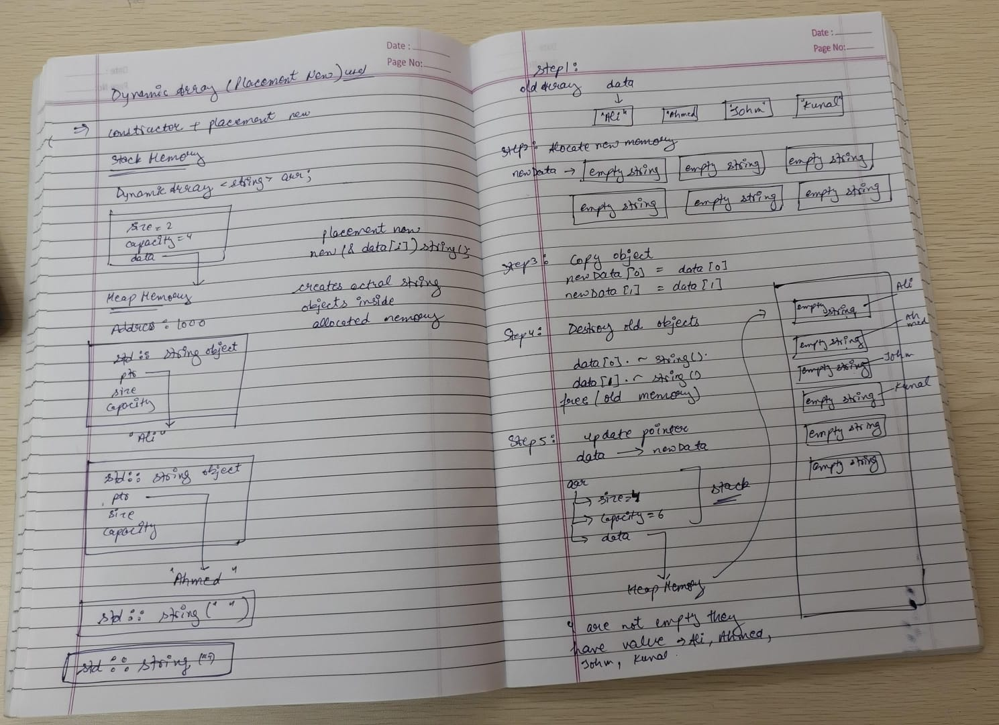

# Daily Design Journal

**Date:** 23 June 2026

---

## Section 1 — Specific Bug

While testing the generic DynamicArray with `std::string`, the program compiled successfully but produced no output.

Test code:

```cpp
DynamicArray<std::string> arr;

arr.append("Ali");
arr.append("Ahmed");

for(int i = 0; i < arr.getSize(); i++)
{
    std::cout << arr.get(i) << std::endl;
}
```

Runtime output:

```text
PS D:\CQ_STL\data_structure_collections> cd "d:\CQ_STL\data_structure_collections\src\DynamicArray\" ; if ($?) { g++ main.cpp -o main } ; if ($?) { .\main }

PS D:\CQ_STL\data_structure_collections\src\DynamicArray>
```

The program terminated normally without displaying any string values.

---

## Section 2 — Failed Attempt

My initial implementation used:

```cpp
malloc()
realloc()
free()
```

for memory management.

The first resizing approach was:

```cpp
T* temp = (T*)realloc(data, newCapacity * sizeof(T));
```

This worked correctly for:

```cpp
DynamicArray<int>
DynamicArray<float>
DynamicArray<char>
```

However, when testing:

```cpp
DynamicArray<std::string>
```

the stored values disappeared after insertion and resizing.

At first I assumed the problem was inside the append function, so I added print statements and checked the resize logic. After debugging, I discovered that `realloc()` only copies raw bytes and does not properly handle C++ objects such as `std::string`.

---

## Section 3 — Memory Diagram

### Memory Diagram

The hand-drawn memory diagram used during debugging is attached below:

```md

```

### Memory Analysis

The diagram illustrates how the DynamicArray stores data in memory and how the resize operation affected `std::string` objects.

Key observations:

* The `DynamicArray` object itself resides on the stack.
* The `data` member is a pointer stored inside the object that points to dynamically allocated memory on the heap.
* `malloc()` allocates a block of raw memory but does not construct any `std::string` objects inside that memory.
* Primitive types such as `int` work because they do not require constructors or destructors.
* `std::string` internally manages additional heap memory and requires proper object construction.
* During resizing, `realloc()` copies raw bytes from the old memory block to a new memory location.
* Since constructors and copy constructors are not invoked during `realloc()`, the internal state of `std::string` objects can become invalid.
* This explains why the program compiled successfully but produced no output when storing strings.
* The corrected implementation uses placement new to construct objects inside allocated memory and explicit destructor calls before releasing memory.
* This ensures that both primitive and non-primitive types are handled correctly.

### Correct Resize Flow

```text
Stack
 └── DynamicArray object
         │
         ▼
      data pointer
         │
         ▼
Heap Memory

Old Array
    ↓
Allocate New Memory
    ↓
Construct Objects (placement new)
    ↓
Copy Existing Elements
    ↓
Destroy Old Objects
    ↓
Free Old Memory
    ↓
Update data Pointer
```

This investigation helped identify the root cause of the `std::string` issue and led to a safer DynamicArray implementation that correctly manages object lifetime.

---

## Section 4 — Code Reference

**Commit Hash:** `<add-your-commit-hash>`

**Files Modified:**

```text
src/DynamicArray/DynamicArray.h
src/DynamicArray/main.cpp
src/LinkedList/LinkedList.h
```

**Relevant Sections:**

```cpp
DynamicArray()
~DynamicArray()
resize()
append()
copy constructor
copy assignment operator
```

```cpp
pushFront()
pushBack()
```

for the initial LinkedList implementation.

---

## Section 5 — Learning Reflection

Today I learned an important difference between raw memory allocation and object construction in C++.

Before today, I assumed that allocating memory using `malloc()` was sufficient for storing any template type. Through debugging the `std::string` issue, I discovered that C++ objects require constructors and destructors to manage their internal resources.

The key realization was that:

```cpp
malloc()
```

allocates memory only,

while

```cpp
new
```

allocates memory and constructs objects.

I also learned why:

```cpp
realloc()
```

is unsafe for non-trivial C++ objects and why containers such as `std::vector` do not use it internally.

This understanding changed how I approached the DynamicArray implementation. Instead of treating memory as raw bytes, I started thinking about object lifetime, construction, destruction, and ownership. That knowledge also influenced the design of the LinkedList implementation, where I decided to use `new` and `delete` for node management.
