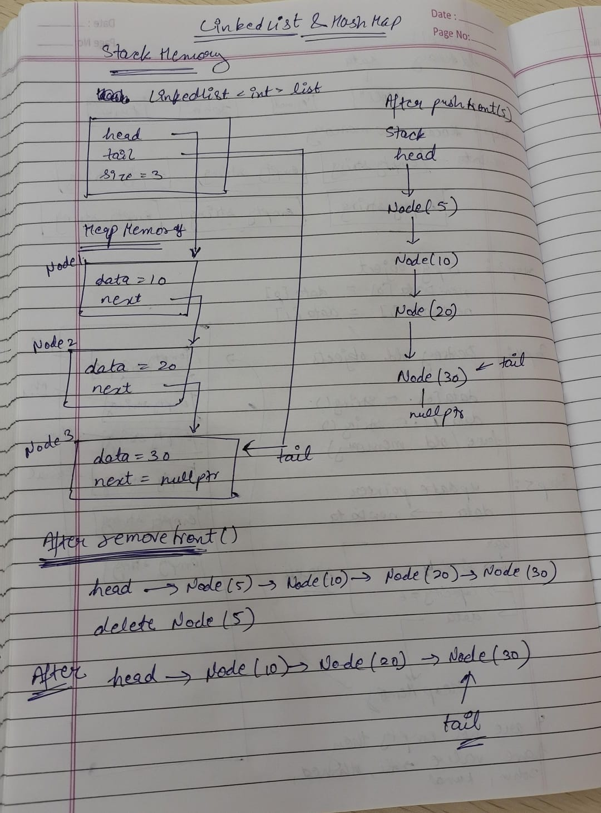

# Daily Design Journal

**Date:** 24 June 2026

---

## Section 1 — Specific Bug

While implementing the generic HashMap, multiple compilation errors occurred.

### DynamicArray Casting Error

Compiler output:

```text
expected primary-expression before '>' token
```

Problematic code:

```cpp
T* newData = <T*>(malloc(newCapacity * sizeof(T)));
```

The compiler rejected the cast because `<T*>` is not valid C++ casting syntax.

---

### Const-Correctness Errors

Compiler output:

```text
passing 'const DynamicArray<LinkedList<Entry<K,V>>>' as 'this' argument discards qualifiers
```

```text
passing 'const LinkedList<Entry<K,V>>' as 'this' argument discards qualifiers
```

These errors occurred while implementing HashMap copy operations and lookup functions because const objects were attempting to call non-const member functions.

---

## Section 2 — Failed Attempt

My first attempt focused on building the HashMap directly on top of the existing DynamicArray and LinkedList implementations.

Initially, I used:

```cpp
other.buckets.get(index);
```

inside copy constructors and assignment operators.

However, because `other` was a const object, the compiler prevented access to non-const member functions.

I also mistakenly used:

```cpp
<T*>(malloc(...))
```

for casting allocated memory, which resulted in compilation errors.

After investigating, I discovered that:

* C++ requires proper casting syntax such as `static_cast<T*>`.
* Generic containers should provide const member functions for read-only access.
* HashMap operations rely heavily on const correctness when working with copied objects.

To resolve these issues, I updated the DynamicArray and LinkedList implementations and corrected the casting syntax.

---

## Section 3 — Memory Diagram

### LinkedList Memory Diagram

The hand-drawn memory diagram submitted with today's work represents the internal memory layout of the LinkedList implementation.

```md

```

### Memory Analysis

Key observations from the LinkedList implementation:

* The LinkedList object itself resides on the stack.
* Every node is dynamically allocated on the heap using `new`.
* `head` points to the first node.
* `tail` points to the last node.
* Each node stores both data and a pointer to the next node.
* Traversal is performed by following the `next` pointers.
* Nodes are released through `delete` during removal operations and inside `clear()`.
* The destructor calls `clear()` to prevent memory leaks.

This memory layout helped verify that insertion, deletion, copying, and cleanup operations correctly maintain node connections.

---

## Section 4 — Code Reference

**Commit Hash:** `<add-your-commit-hash>`

**Files Modified:**

```text
src/LinkedList/LinkedList.h
src/HashMap/HashMap.h
src/DynamicArray/DynamicArray.h
src/HashMap/main.cpp
```

**Relevant Sections:**

```cpp
LinkedList Copy Constructor
LinkedList Assignment Operator

insert()
removeFront()
removeBack()
removeAt()

contains()
get()
clear()
```

```cpp
Entry<K,V>

DefaultHasher<int>
DefaultHasher<char>
DefaultHasher<std::string>

HashMap()
~HashMap()

put()
get()
containsKey()
remove()
clear()

hashFunction()
size()
isEmpty()
```

```cpp
DynamicArray::get() const
LinkedList::get() const
```

---

## Section 5 — Learning Reflection

Today I learned how multiple custom data structures can work together to build a more complex container such as a HashMap.

Completing the LinkedList implementation helped me better understand dynamic memory management, node ownership, and deep copying. Implementing the copy constructor and assignment operator reinforced the importance of the Rule of Three.

While building HashMap, I learned how separate chaining uses linked lists to handle collisions. Instead of relying on STL containers or `std::hash`, I implemented a custom hashing framework and gained a clearer understanding of how keys are transformed into bucket indices.

The most valuable lesson was understanding const-correctness in generic programming. Although my containers were functioning correctly, the compiler errors showed that supporting read-only access is essential when working with const objects. Adding const versions of member functions improved both correctness and reusability.

By the end of the day, the LinkedList implementation was fully completed, the HashMap architecture was established, and the core HashMap operations were successfully implemented and tested with multiple key types.
