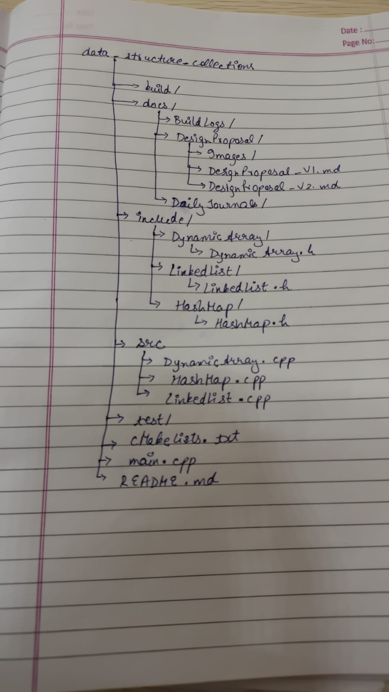

# Daily Design Journal 

**Date:** 25-06-2026

---

# Section 1 — Specific Bug

## Bug 1: CMake Command Not Recognized

**Compiler Output**

```text
'cmake' is not recognized as an internal or external command,
operable program or batch file.
```

## Bug 2: Build Configuration Verification

After installing CMake, the project build configuration needed to be verified to ensure the compiler was correctly detected and the project could be compiled successfully.

---
# Section 2 — Failed Attempt

Initially, I installed CMake but forgot to configure its installation directory in the system **PATH** environment variable. Because of this, the terminal could not recognize the `cmake` command and the build process could not begin.

After identifying the issue, I added the CMake executable directory to the system PATH, restarted the terminal, and verified the installation using:

```bash
cmake --version
```

Once the installation was confirmed, I created a `CMakeLists.txt` file to automate project compilation and generated the required build files.

In the second development session, I reorganized the project into a modular directory structure by separating header files, source files, and documentation into dedicated folders. After restructuring, I rebuilt the project to ensure that all include paths and build configurations were still valid.

Alongside the environment setup, I also began researching the design of a generic `HashMap`. I studied how standard hash tables support different key types, especially user-defined classes, and explored possible approaches for generic hashing. Although the implementation was completed later, this research helped me understand the challenges involved in designing a reusable hashing framework and influenced the overall structure of the project.

---
# Section 3 — Folder Strucure Diagram

Updated Folder Structure


```md

```

---

# Section 4 — Code Reference


**Files Modified**

```text
BuildLogs
DailyJournal
CMakeLists.txt
main.cpp
include/
src/
```

**Relevant Changes**

* Installed and configured the CMake build system.
* Created the initial `CMakeLists.txt`.
* Generated build files.
* Reorganized the project into a modular folder structure.
* Verified successful compilation after restructuring.

---

# Section 5 — Learning Reflection

Today's work helped me understand the importance of setting up a proper build system before implementing any data structures. I learned that CMake is more than just a compilation tool—it provides a platform-independent way to configure builds, detect compilers automatically, and manage project dependencies.

I also realized the value of organizing a project into separate `include`, `src`, and `docs` directories at an early stage. Initially, I viewed project organization mainly as a matter of readability. After restructuring and rebuilding the project, I understood that a modular directory layout also simplifies maintenance, improves scalability, and makes it easier to integrate additional data structures without affecting the overall build configuration.

In addition, I spent time researching how a generic `HashMap` can support both primitive and user-defined key types. My initial intuition was that a single generic hashing function should work for every type, but I discovered that handling user-defined objects requires careful design. This research helped me understand the role of templates, specialized hash functions, and generic fallback mechanisms, and it provided a clear design direction for the `HashMap` implementation that was developed in the following session.

